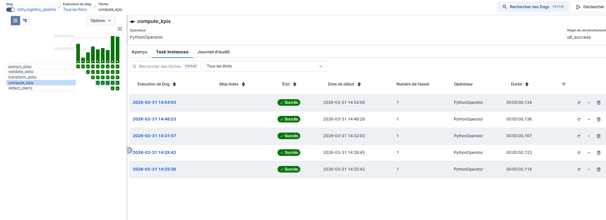

# Airflow Logistics Data Pipeline


---

## Overview

This project implements an end-to-end data pipeline using Apache Airflow to simulate a real-world logistics business scenario.

In logistics operations, shipment data includes routes, schedules, costs, and revenues, but it is often inconsistent or incomplete.

This pipeline transforms raw operational data into clean, structured, and actionable insights.

---

### Example Dataset

Below is a simplified view of the raw shipment data:

| shipment_id | route_id | planned_arrival | actual_arrival | distance_km | fuel_cost | revenue | status     |
|------------|----------|----------------|----------------|------------|----------|---------|-----------|
| S001       | R001     | 12:00          | 12:20          | 220        | 95       | 420     | Delivered |
| S003       | R003     | 11:30          | 12:40          | 180        | 80       | 390     | Delivered |
| S007       | R005     | 14:00          | —              | 250        | 110      | 500     | In Transit |

This type of data requires processing before it can be used for business analysis.

---

### After Processing

The pipeline enriches the data with business metrics:

```
arrival_delay_min: 70  
on_time_delivery: No  
profit: 310  
delay_category: Major Delay  
```

---

### What the Pipeline Does

- Validates data to ensure quality  
- Enriches shipments with operational and financial metrics  
- Computes KPIs for performance monitoring  
- Detects anomalies and operational risks  

---

### Business Value

This enables:

- Monitoring delivery performance (on-time vs delayed)  
- Identifying inefficient routes and delays  
- Tracking profitability per shipment  
- Detecting issues early through automated alerts  

---

The pipeline is orchestrated using Airflow and runs in a Docker environment, following a modular and production-oriented design.

## Pipeline Architecture

```text
extract_data → validate_data → transform_data → compute_kpis → detect_alerts
```

Each task represents a key stage of a real-world data pipeline.

---

## Pipeline Steps

### Extract Data
- Reads raw shipment data from a CSV file
- Prepares data for downstream processing

---

### Validate Data

Ensures data quality by checking:

- Missing critical fields  
- Invalid shipment status values  
- Numeric conversion issues  
- Date inconsistencies  

Invalid records are saved to:

```bash
data_quality_issues.csv
```

---

### Transform Data

Enriches the dataset with business logic:

- Delay calculations:
  - `departure_delay_min`
  - `arrival_delay_min`

- Indicators:
  - `on_time_delivery`
  - `delay_category`

- Financial metrics:
  - `profit`
  - `profit_margin_pct`

Output:

```bash
shipments_processed.csv
```

---

### Compute KPIs

#### Global KPIs

- Total shipments  
- Delivered shipments  
- In-transit shipments  
- On-time delivery rate  
- Average arrival delay  
- Total revenue, fuel cost, and profit  

Saved as:

```bash
kpi_summary.json
```

#### Aggregations

- By route  
- By customer  

Outputs:

```bash
kpi_by_route.csv  
kpi_by_customer.csv
```

---

### Detect Alerts

Identifies operational anomalies:

- HIGH_ARRIVAL_DELAY (>60 min)  
- HIGH_DEPARTURE_DELAY (>30 min)  
- LOW_PROFIT (<50)  
- CRITICAL_DELAY (>90 min)  
- NEGATIVE_DELAY  
- LONG_DISTANCE_LOW_PROFIT  

Output:

```bash
alerts.csv
```

---

## Data Flow

### Raw Input


### Processed Data


---

## Pipeline Execution

### DAG Graph


### Task Logs


---

## Docker Environment

### Running Containers


This project runs entirely inside Docker containers to ensure consistency and reproducibility.

Airflow services running:

- airflow-apiserver  
- airflow-scheduler  
- airflow-dag-processor  
- airflow-triggerer  
- postgres  

---

## Tech Stack

- Python  
- Apache Airflow  
- Pandas  
- Docker  

---

## Running the Project

### Start the environment

```bash
docker-compose up -d
```

---

### Initialize Airflow (first time only)

```bash
docker-compose up airflow-init
```

---

### Access Airflow UI

```bash
http://localhost:8080
```

Default credentials:

```bash
username: airflow
password: airflow
```

---

## Quick Setup (Windows + Docker)

### 1. Install Docker Desktop
Download and install Docker Desktop and ensure it is running.

---

### 2. Clone the repository

```bash
git clone https://github.com/your-username/airflow-logistics-pipeline.git
cd airflow-logistics-pipeline
```

---

### 3. Start Airflow

```bash
docker-compose up airflow-init
docker-compose up -d
```

---

### 4. Open Airflow

Go to:

```bash
http://localhost:8080
```

Enable the DAG and trigger execution.

---

## Project Structure

```bash
airflow-logistics-pipeline/
│
├── dags/
│   └── daily_logistics_pipeline.py
│
├── data/
│   ├── raw/
│   │   └── shipments.csv
│   └── processed/
│
├── screenshots/
│   ├── dag_graph.png
│   ├── task_success.png
│   ├── docker.png
│
├── docker-compose.yaml
├── README.md
└── .gitignore
```

---

