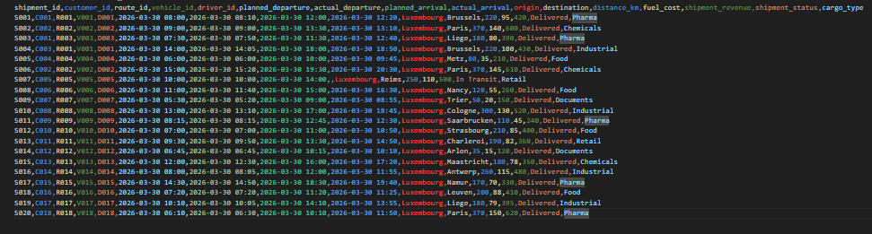
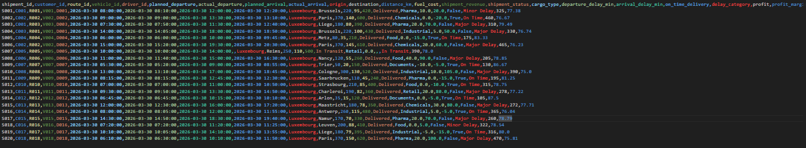
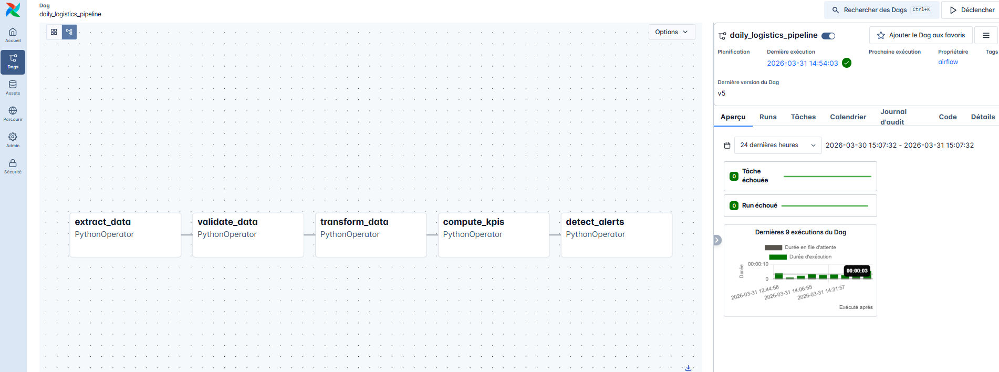
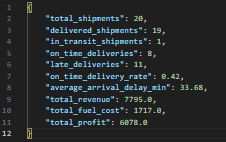
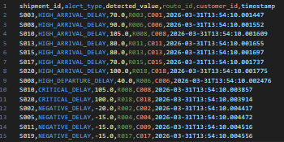
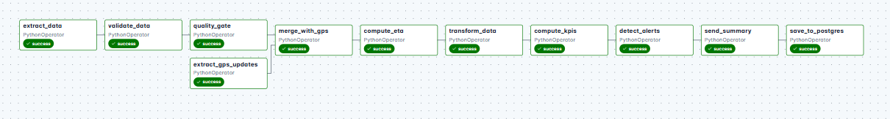
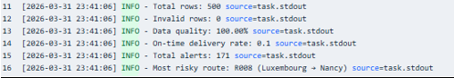
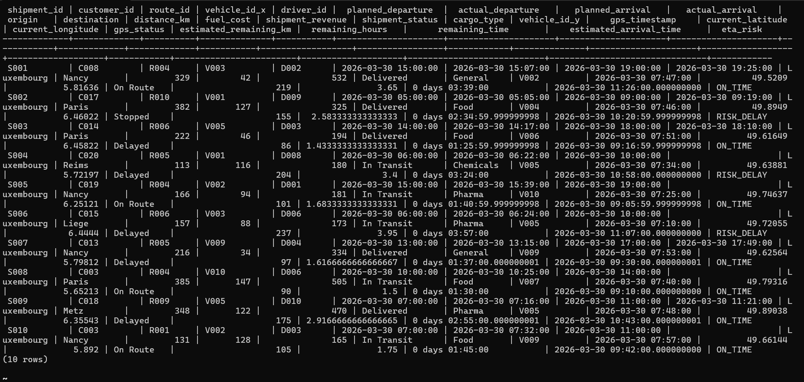
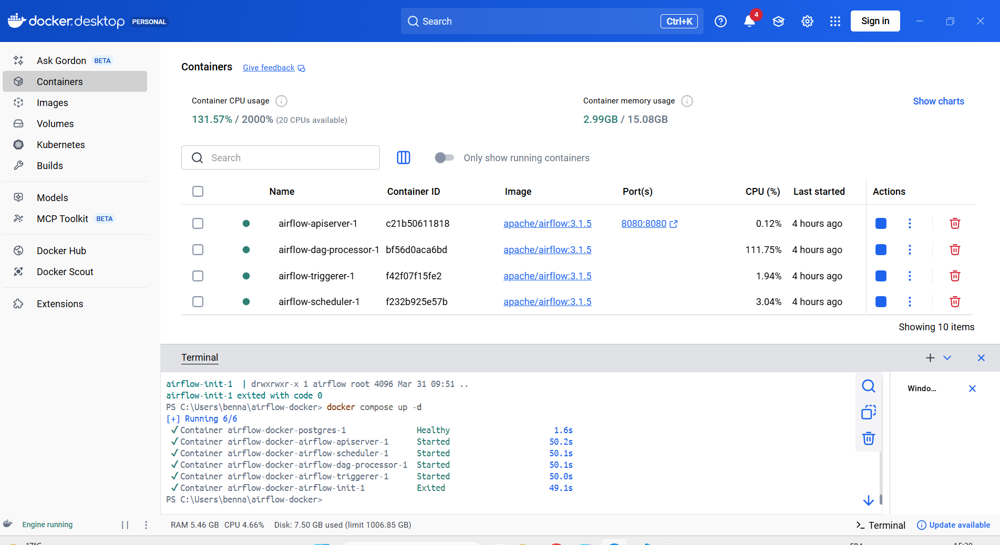

# Airflow Logistics Data Pipeline


---

## Overview

This project implements an end-to-end data pipeline using Apache Airflow to simulate a real-world logistics business scenario.

In logistics operations, shipment data includes routes, schedules, costs, and revenues, but it is often inconsistent or incomplete.

This pipeline transforms raw operational data into clean, structured, and actionable insights.

---

### Example Dataset

Below is a simplified view of the raw shipment data:

| shipment_id | customer_id | route_id | vehicle_id | driver_id | planned_departure | actual_departure | planned_arrival | actual_arrival | origin | destination | distance_km | fuel_cost | shipment_revenue | shipment_status | cargo_type |
|---|---|---|---|---|---|---|---|---|---|---|---|---|---|---|---|
| S001 | C001 | R001 | V001 | D001 | 2026-03-30 08:00 | 2026-03-30 08:10 | 2026-03-30 12:00 | 2026-03-30 12:20 | Luxembourg | Brussels | 220 | 95 | 420 | Delivered | Pharma |
| S002 | C002 | R002 | V002 | D002 | 2026-03-30 09:00 | 2026-03-30 09:00 | 2026-03-30 13:30 | 2026-03-30 13:10 | Luxembourg | Paris | 370 | 140 | 600 | Delivered | Chemicals |
| S007 | C005 | R005 | V005 | D005 | 2026-03-30 10:00 | 2026-03-30 10:00 | 2026-03-30 14:00 | — | Luxembourg | Reims | 250 | 110 | 500 | In Transit | Retail |



---

### After Processing

The pipeline enriches each shipment with calculated business metrics:

| Column | Example Value |
|---|---|
| `departure_delay_min` | 10.0 |
| `arrival_delay_min` | 20.0 |
| `on_time_delivery` | False |
| `delay_category` | Minor Delay |
| `profit` | 325.77 |
| `profit_margin_pct` | 77.38 |



---

### What the Pipeline Does

- Validates data to ensure quality
- Enriches shipments with operational and financial metrics
- Computes KPIs for performance monitoring
- Detects anomalies and operational risks

---

### Business Value

This enables:

- Monitoring delivery performance (on-time vs delayed)
- Identifying inefficient routes and delays
- Tracking profitability per shipment
- Detecting issues early through automated alerts

---

## Project Structure

```bash
airflow-logistics-pipeline/
│
├── dags/
│   └── daily_logistics_pipeline.py
│
├── data/
│   ├── raw/
│   │   ├── shipments.csv
│   │   └── gps_updates.csv
│   └── processed/
│
├── screenshots/
│   ├── dag_graph.png
│   ├── dag_full_pipeline.png
│   ├── docker.png
│   ├── input_data.png
│   ├── processed_data.png
│   ├── kpi_summary.png
│   ├── alerts_output.png
│   ├── execution_summary.png
│   └── postgres_table_preview.png
│
├── docker-compose.yaml
├── README.md
└── .gitignore
```

---

## Tech Stack

- Python
- Apache Airflow
- Pandas
- Docker
- PostgreSQL

---

# Phase 1 — Core Logistics Pipeline

## Pipeline Architecture

```text
extract_data → validate_data → transform_data → compute_kpis → detect_alerts
```

Each task represents a key stage of a real-world data pipeline.



---

## Pipeline Steps

### Extract Data
- Reads raw shipment data from `shipments.csv`
- Prepares data for downstream processing

---

### Validate Data

Ensures data quality by checking:

- Missing critical fields
- Invalid shipment status values
- Numeric conversion issues
- Date inconsistencies (e.g. arrival before departure, delivered shipment without actual arrival)

Invalid records are saved to:

```
data_quality_issues.csv
```

---

### Transform Data

Enriches the dataset with business logic:

**Delay calculations:**
- `departure_delay_min`
- `arrival_delay_min`

**Indicators:**
- `on_time_delivery`
- `delay_category` → On Time / Minor Delay / Major Delay / In Transit

**Financial metrics:**
- `profit` = revenue − fuel_cost
- `profit_margin_pct`

Output:

```
shipments_processed.csv
```

---

### Compute KPIs

#### Global KPIs

- Total shipments
- Delivered shipments
- In-transit shipments
- On-time delivery rate
- Average arrival delay
- Total revenue, fuel cost, and profit

Saved as:

```
kpi_summary.json
```

Example output from a real pipeline run:

```json
{
  "total_shipments": 20,
  "delivered_shipments": 19,
  "in_transit_shipments": 1,
  "on_time_deliveries": 8,
  "late_deliveries": 11,
  "on_time_delivery_rate": 0.42,
  "average_arrival_delay_min": 33.68,
  "total_revenue": 7795.0,
  "total_fuel_cost": 1717.0,
  "total_profit": 6078.0
}
```



#### Aggregations

- By route → `kpi_by_route.csv`
- By customer → `kpi_by_customer.csv`

---

### Detect Alerts

Identifies operational anomalies:

| Alert Type | Condition |
|---|---|
| `HIGH_ARRIVAL_DELAY` | arrival_delay_min > 60 |
| `HIGH_DEPARTURE_DELAY` | departure_delay_min > 30 |
| `LOW_PROFIT` | profit < 50 |
| `CRITICAL_DELAY` | Delivered + arrival_delay_min > 90 |
| `NEGATIVE_DELAY` | arrival_delay_min < -10 |
| `LONG_DISTANCE_LOW_PROFIT` | distance_km > 300 and profit < 100 |

Output:

```
alerts.csv
```



---

# Phase 2 — Professional Extension (GPS + ETA + Quality Gate)

## Extended Pipeline Architecture

```text
extract_shipments ─┐
                   ├─→ merge_with_gps → compute_eta → transform_data → compute_kpis → detect_alerts → quality_gate → send_summary
extract_gps ───────┘
                   ↓
              validate_shipments
```



---

## New Data Source — GPS Updates

A second input file `gps_updates.csv` provides real-time vehicle tracking data:

| shipment_id | vehicle_id | gps_timestamp | latitude | longitude | gps_status | estimated_remaining_km |
|---|---|---|---|---|---|---|
| S001 | V001 | 2026-03-30 10:30 | 49.61 | 6.13 | On Route | 95 |
| S002 | V002 | 2026-03-30 11:15 | 49.81 | 6.12 | On Route | 180 |
| S007 | V005 | 2026-03-30 12:00 | 49.70 | 6.05 | Delayed | 120 |

Each shipment may have multiple GPS updates over time. The pipeline retains only the **most recent position** per shipment before merging.

---

## Phase 2 Steps

### Extract GPS Updates
- Reads `gps_updates.csv`
- Validates structure and data availability

---

### Merge Shipments with GPS

Joins shipment data with the latest GPS record per shipment using `shipment_id` as the key.

Each row is enriched with:
- Last known position (latitude, longitude)
- Current GPS status
- Estimated remaining distance

Output:

```
shipments_gps_enriched.csv
```

---

### Compute ETA

Estimates the arrival time based on remaining distance, assuming an average speed of **60 km/h**.

```
ETA = last GPS timestamp + (estimated_remaining_km / 60h)
```

Each shipment is then classified:

| eta_risk | Condition |
|---|---|
| `ON_TIME` | ETA ≤ planned_arrival |
| `RISK_DELAY` | ETA > planned_arrival |

---

### Quality Gate

Measures the proportion of invalid rows detected during validation.

- If error rate **≤ 20%** → pipeline continues normally
- If error rate **> 20%** → pipeline is automatically stopped

This prevents downstream KPIs and alerts from being computed on poor-quality data.

---

### Send Summary

A final task prints an execution summary to the Airflow logs:

```
Total rows:            500
Invalid rows:            0
Data quality:        100.00%
On-time delivery rate: 0.1
Total alerts:          171
Most risky route:    R008 (Luxembourg → Nancy)
```



---

## PostgreSQL Integration

Processed data is saved to a PostgreSQL database running inside Docker, enabling direct connection to BI tools such as Power BI.

**Connection settings (Airflow UI → Admin → Connections):**

| Field | Value |
|---|---|
| Connection ID | `tutorial_pg_conn` |
| Type | Postgres |
| Host | `postgres` |
| Database | `airflow` |
| User | `airflow` |
| Password | `airflow` |
| Port | `5432` |



---

## Pipeline Robustness

All tasks are configured with automatic retry logic:

```python
default_args = {
    "retries": 2,
    "retry_delay": timedelta(minutes=5),
}
```

This handles transient failures such as file read errors or temporary unavailability, simulating a production-ready pipeline.

---

## Docker Environment

This project runs entirely inside Docker containers.



Airflow services running:

- `airflow-apiserver`
- `airflow-scheduler`
- `airflow-dag-processor`
- `airflow-triggerer`
- `postgres`

---

## Running the Project

### Initialize Airflow (first time only)

```bash
docker-compose up airflow-init
```

### Start the environment

```bash
docker-compose up -d
```

### Access Airflow UI

```
http://localhost:8080
```

Default credentials:

```
username: airflow
password: airflow
```

---

## Quick Setup (Windows + Docker)

**1. Install Docker Desktop** and make sure it is running.

**2. Clone the repository:**

```bash
git clone https://github.com/your-username/airflow-logistics-pipeline.git
cd airflow-logistics-pipeline
```

**3. Start Airflow:**

```bash
docker-compose up airflow-init
docker-compose up -d
```

**4. Open the UI** at `http://localhost:8080`, enable the DAG and trigger execution.

---

## Output Files

| File | Description |
|---|---|
| `shipments_processed.csv` | Enriched shipment data with delay and financial metrics |
| `shipments_gps_enriched.csv` | Shipments merged with latest GPS data and ETA |
| `data_quality_issues.csv` | Rows that failed validation |
| `kpi_summary.json` | Global KPIs |
| `kpi_by_route.csv` | KPI aggregation by route |
| `kpi_by_customer.csv` | KPI aggregation by customer |
| `alerts.csv` | Detected operational anomalies |